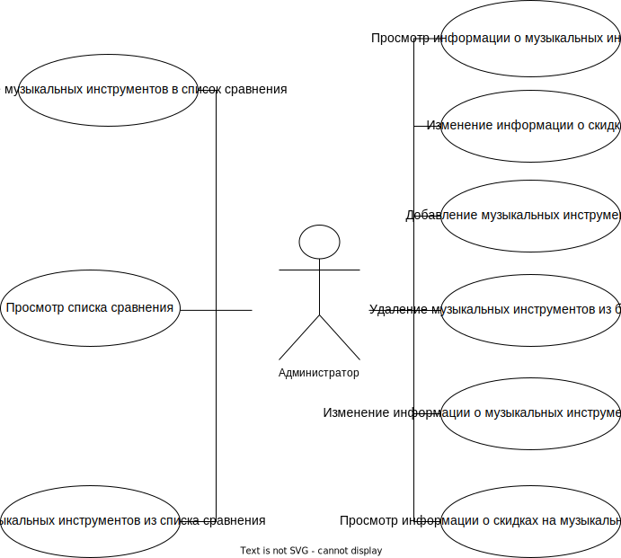
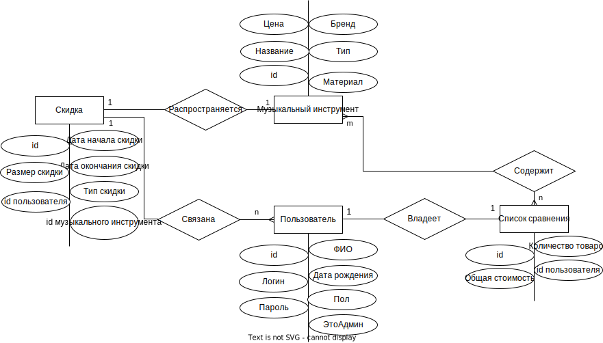
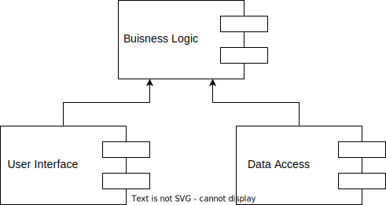
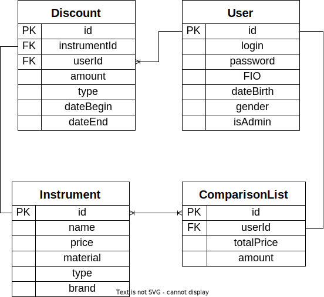

# Скидки в цифровом магазине музыкальных инструментов

## Идея проекта

Создание информационной системы для просмотра пользователями информации о музыкальных инструментах и скидках на их покупку. Разрабатываемое ПО должно предоставлять интерфейс для взаимодействия с базой данных с возможностью создавать каждому отдельному пользователю индивидуальный список сравнения. Также администратор магазина должен иметь возможность добавлять, удалять и редактировать информацию о музыкальных инструментах.

## Предметная область

Предметной областью являются цифровые магазины музыкальных инструментов.

Гость (неавторизованный пользователь) имеет доступ к просмотру данных в системе, поиску информации о музыкальных инструментах и ее фильтрации по параметрам: цена, бренд, материал. Также такой пользователь может пройти регистрацию и стать зарегистрированным пользователем.

Зарегистрированный пользователь дополнительно имеет возможности просматривать свой список сравнения, добавлять музыкальные инструменты в этот список и удалять их оттуда.

Администратор, помимо возможностей зарегистрированного пользователя, может добавлять, удалять и изменять информацию о музыкальных инструментах.

## Анализ аналогичных решений

На сегодняшний день существует несколько сайтов, позволяющих просматривать информацию о музыкальных инструментах и скидках на их покупку:

* Музторг
* Глинки.ру
* Music Store
* Musician's Friend

Сравним существующие решения по следующим критериям.

1. Возможность добавления музыкальных инструментов в список сравнения.
2. Возможность фильтрации списка музыкальных инструментов по различным параметрам.
3. Доступность в РФ.

| Решение                 | 1    | 2    | 3    |
| ----------------------- | ---- | ---- | ---- |
| Музторг                 | -    | +    | +    |
| Глинки.ру               | -    | +    | +    |
| Music Store             | +    | +    | -    |
| Musician's Friend       | -    | +    | -    |
| Разрабатываемое решение | +    | +    | +    |

## Целесообразность и актуальность проекта

В музыкальных инструментах заинтересовано большое количество людей. Так как современные цифровые магазины предоставляют большой ассортимент музыкальных инструментов, возникает проблема сложности сравнения товаров и отслеживания акций и скидок. Перечисленные выше решения не соответствуют всем критериям, что затрудняет взаимодействие пользователей с ними. Большинство решений не поддерживает удобный список сравнения музыкальных инструментов. Также некоторые решения недоступны в РФ.

## Use-Case - диаграмма

## ER-диаграмма сущностей

## Пользовательские сценарии

Гость может:

1. Зайти на страницу со всеми музыкальными инструментами.
2. Находясь на странице со всеми музыкальными инструментами, отфильтровать их (по цене, бренду или материалу, можно комбинировать параметры фильтрации)
3. Находясь на странице со всеми музыкальными инструментами, зайти на страницу конкретного музыкального инструмента.
4. Находясь на странице со всеми музыкальными инструментами, посмотреть информацию о скидках на музыкальные инструменты.
5. Зайти на страницу регистрации, остаться на ней или перейти на страницу авторизации.
6. Зайти на страницу авторизации, остаться на ней или перейти на страницу регистрации.
7. Находясь на странице регистрации, зарегистрироваться.
8. Находясь на странице авторизации, авторизоваться.

Пользователь может:

1. Выполнять действия 1-4 для гостя.
2. Находясь на странице со всеми музыкальными инструментами или на странице конкретного музыкального инструмента, добавить музыкальный инструмент в список сравнения.
3. Зайти на страницу своего профиля.
4. Находясь на странице своего профиля, зайти на страницу списка сравнения.
5. Находясь на странице списка сравнения, удалить музыкальный инструмент из этого списка.
6. Находясь на любой странице, выйти из аккаунта.

Администратор может:

1. Выполнять все действия пользователя.
2. Зайти на страницу админ-панели.
3. Находясь на странице админ-панели, добавить новый музыкальный инструмент.
4. Находясь на странице админ-панели, удалить существующий музыкальный инструмент.
5. Находясь на странице админ-панели, изменить информацию о музыкальном инструменте.
6. Находясь на странице админ-панели, изменить информацию о скидках.
Доступны следующие типы скидок и акций.
* Процентная скидка (дата начала $b$, дата окончания $e$, размер скидки $v$)
* Cкидка на день рождения (дата начала $b$, дата окончания $e=b$, размер скидки $v$).
* При покупке $n$ товаров $m$ таких же товаров предоставляется в подарок.
* Скидка пользователям в определенную дату в зависимости от пола (дата начала $b$, дата окончания $e$, размер скидки $v$).

## **Формализация бизнес-правил, BPMN-диаграмма**

* Добавление музыкального инструмента в список сравнения.

* Удаление музыкального инструмента из списка сравнения.

## Описание типа приложения и выбранного технологического стека

**Тип приложения**: Web SPA

**Технологический стек**:

1. Backend: Golang
2. Frontend: React Rudex
3. База данных: PostgreSQL

## Верхнеуровневое разбиение на компоненты

## UML-диаграмма классов всего приложения

## ER-диаграмма сущностей базы данных

